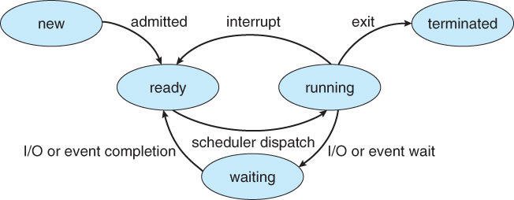

# Operating System

## 운영체제

  
운영체제란 무엇인가요?

   

- `Operating System`으로 흔히 `OS`라 부르며 사용자가 컴퓨터를 편리하고 효과적으로  사용할 수 있도록 환경을 제공하는 시스템 소프트웨어입니다.
- ### 종류
    - UNIX
    - Linux
    - Windows
- ### 역할
    - `프로세스 관리` : 운영체제에서 적용하는 응용 프로그램을 관리
    - `저장장치 관리` : 1차 저장장치(Main Memory)와 2차 저장장치(HDD, NAND Flash Memory 등)를 관리하는 기능
    - `네트워킹` : 네트워크 프로토콜 지원
    - `사용자 관리` : 파일 및 시스템 자원 접근 권한 지정하여 사용자 관리
    - `디바이스 드라이버` : 시스템 자원, 하트웨어 관리 / `하드웨어를 추상화 해주는 계층`

  
프로세스 주소 공간은 어떻게 이루어져 있고 왜 나누었나요?/메모리 영역은 어떻게 나눠져있나요?

   

- 최대한 데이터를 공유하여 메모리 사용량을 줄여야 하기에 나누었습니다.

- ### 프로세스 주소 공간(메모리 영역)
    - `Code` : 코드 자체를 구성하는 메모리 영역
    - `Data` : 전역변수, 정적변수, 배열 등이 할당되는 영역
    - `Heap` : 동적 할달시 사용되는 영역
    - `Stack` : 함수의 호출 정보, 지역변수, 매개변수 등이 저장되는 영역

  
프로세스와 스레드를 각각 설명하고 차이를 말씀해 주세요.

   

- **프로세스** : 메모리 상에서 실행중인 프로그램
- **스레드** : 프로세스 안에서 실행되는 흐름단위

- 하나의 프로세스 생성시, 기본적으로 하나의 스레드 생성
- 스레드는 프로세스 내에서 Stack만 따로 할당받고, 그 이외의 메모리 영역(Code, Data, Heap) 영역을 공유

  
멀티 프로세스와 멀티 스레드의 장단점을 설명해 주세요.

   

- 멀티 프로세스
  - 장점 : 안정성(OS 차원에서 해결)
  - 단점 : 각각 독립된 메모리 영역을 가지고 있음 
          => 작엄량 증가 
          => `Context Switching` 증가 
          => 오버헤드 발생 
          => 성능 저하 

- 멀티 스레드
  - 장점 : 메모리 공유, 시간 및 자원 손실 감소
  - 단점 : 공유메모리로 안정성 문제 발생 
          -> 하나의 스레드가 데이터 공간을 망가뜨리면 모든 스레드가 작동 불능 
          -> **But**, **Critical Section 기법**을 통해 대비 가능 

  **Critical Section 기법** : 하나의 스레드가 공유 데이터 값을 변경하는 시점에 다른 스레드가 그 값을 읽으려 할 때 발생하는 문제를 해결하기 위한 동기화 과정

  
인터럽트(Interrupt)란 무엇인가요?

   

- 프로그램 실행 도중 예기치 않은 상황이 발생하여 현재 실행중인 작업을 즉시 중단하고 발생된 상황에 대한 우선 처리가 필요함을 CPU에게 알리는 것입니다.

- ### 종류
  - **외부 인터럽트** : 입출력 장치, 차이밍 장치, 전원 등 외부적 요인으로 발생
  - **내부 인터럽트(Trap)** : `Trap`이라 부르며 오버플로우, 명령어 오사용 등 잘못된 명령이나 데이터를 사용할 때 발생
  - **소프트웨어 인터럽트** : 프로그램 처리 중 명령의 요청에 의해 발생한 것

- 내외부 인터럽트는 CPU의 하드웨어 신호에 의해 발생하며 소프트웨어 인터럽트는 명령어 수행에 의해 발생합니다.
- 인터럽트가 없다면 `폴링(Polling)` 사용
  - `폴링(Poliing)` : 사용자가 명령어를 사용해 수시로 확인해서 변화를 알아내는 방식

  
시스템 콜(System Call)에 대하여 설명해 주세요.

   

- 응용 프로그램의 요청에 따라 kernel에 접근하기 위한 인터페이스입니다.

- ### 유형
  - 프로세스 제어
  - 파일 조작
  - 장치 조작
  - 정보 유지보수
  - 통신과 보호

- 프로세스 제어를 위한 System Call에는 fork, exec, wait 등이 있습니다.

  
PCB란 무엇인가요?

   

- **Process Control Block**으로 process 정보를 저장하는 곳입니다.
- `Context Switching`시 이전 작업을 저장하기 위해서 필요합니다. 
- `Linked List`방식으로 관리합니다.

  
Context Switching이란 무엇인가요?

   

- CPU가 이전의 프로세스 상태를 PCB에 보관 후 다른 프로세스 정보를 PCB에 읽어 레지스터에 적재하는 과정입니다.
- CPU가 놀지 않게 만들며 빠른 일처리를 제공하기 위한 것입니다.
- 보통 Interrupt 또는 CPU 사용 허가 시간 초과시 발생

  
IPC란 무엇인가요?

   

- 프로세스는 독립적인 구조를 가지기에 통신을 해야합니다. 이를 가능하게 해주는 것이 Inter Process Communication이라 불리는 IPC통신입니다.
- 프로세스는 커널이 제공하는 IPC설비를 이용해 프로세스간 통신을 할 수 있게 됩니다.
- IPC 통신에서 프로세스 간 데이터를 동기화하고 보호하기 위해 `세마포어`와 `뮤텍스`를 사용합니다.

  
CPU 스케줄링에 대하여 설명해 주세요.

   

- 정해져 있는 자원을 분배하여 프로세스가 CPU를 사용할 수 있게 결정하는 정책입니다.
- 종류로는 크게 선점(preemptive) 스케불링과 비선점(non-preemptive) 스케줄링으로 나누어져있습니다.

- 선점(preemptive) 스케줄링
  - 하나의 프로세스가 CPU를 할당받아 실행하고 있을 때, 우선순위가 높은 프로세스가 CPU를 강제로 빼앗아 사용할 수 있는 기법입니다.
  - 처리 시간 예측이 어렵고 선점으로 인한 오버헤드가 발생한다는 단점이 있습니다.
  - ex) `Priority Scheduling`, `Round Robin`, `Multilevel-Queue(다단계 큐)`, `Multilevel-Feedback-Queue(다단계 피드백 큐)`

- 비선점(non-preemptive) 스케줄링
  - 이미 할당된 CPU를 다른 프로세스가 강제로 배앗아 사용할 수 없는 기법입니다.
  - 공정하며 처리 시간 예측이 용이하다는 장점이 있지만 긴급응답을 요청하는 작업에는 좋지 않다는 단점도 존재합니다.
  - ex) `FCFS(First Come First Served)`, `SJF(Shortest Job First)`, `HRN(Highest Response-ratio Next)`

- 척도
  - `Response Time` : 작업이 처음 실행되기까지 걸린 시간
  - `Turnaround Time` : 실행 시간과 대기 시간을 모두 합한 시간으로 작업이 완료될 때 까지 걸리는 시간

