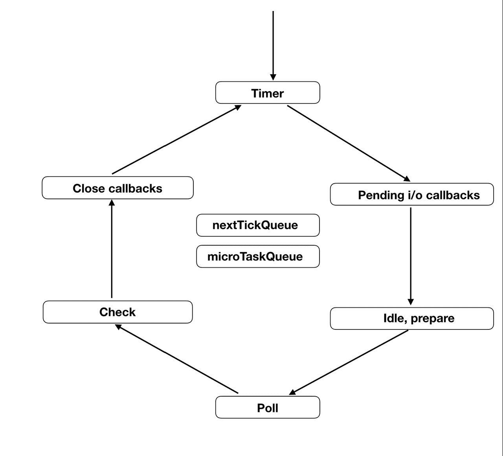

# NodeJS

- V8 엔진 기반의 JavaScript 런타임입니다.
- V8 엔진과 Event Loop 기반의 libuv로 이루어져있습니다.
- Event-driven 논 블로킹 I/O가 특징입니다.

## Event-Loop

- Event-Loop는 6개의 Phase로 구성되어 있으며 Call Stack이 빈 상태가 되면, Event Queue의 첫번째 콜백을 Call Stack으로 밀어넣는다.
- 이러한 반복적인 행동을 `틱(tick)` 이라 부른다.
- 라운드 로빈 형식으로 진핼 된다.

